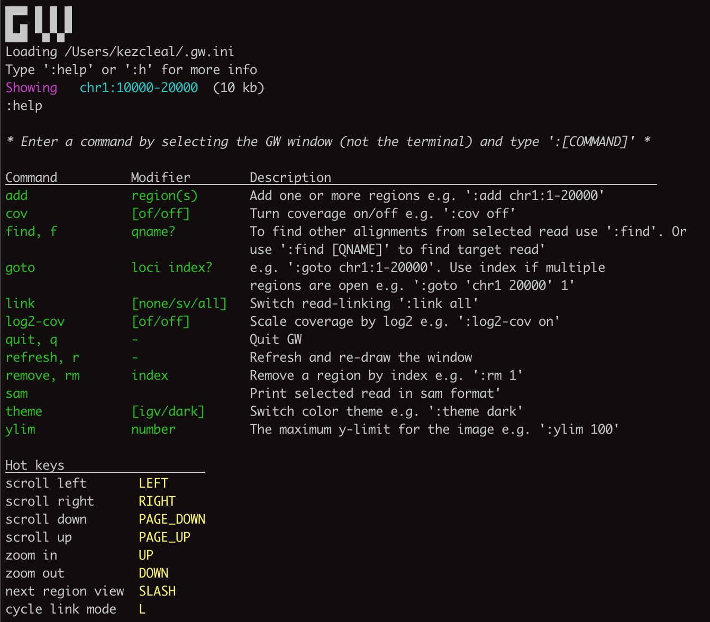

GW
==

.. image:: inc/banner.png
    :align: center

GW is a fast browser for sequencing data (.bam/.cram format) used directly from the terminal. GW can also be used to
view and label variant data from vcf files and display these as image-tiles for annotation. Check out the examples below!

Installing GW
--------------

The easiest way to get GW up and running is to grab one of the pre-built binaries from the release page::

    wget https://github.com/kcleal/gw/releases/gw....blah

GW is built using clang and make, and requires glfw and skia libraries. If you need to build GW from source,
we have put together a build script to try and make this pain free. You can run this using one of the
following::

    build_gw.sh linux
    build_gw.sh mac
    build_gw.sh windows

If you want to manually build GW, we recommend using a pre-built skia binary from jetbrains https://github.com/JetBrains/skia-build/releases/tag/m93-87e8842e8c.
Aim for directory structure like this::

    ./dir
    ..../gw
    ..../skia

And build GW using::

    cd gw && make

Old build instructions
-----------------------

For linux::

    sudo apt install clang cmake
    sudo apt install libglfw3 libglfw-dev

or::

    wget https://github.com/glfw/glfw/releases/download/3.3.8/glfw-3.3.8.zip && \
    cd glfw-3.3.8 && \
    cmake -S . -B build && \
    cd build && \
    sudo make install

For Mac::

    brew install glew glfw3

Get skia binaries from https://github.com/JetBrains/skia-build/releases/tag/m93-87e8842e8c

Aim for directory structure like this::

    ./dir
    ..../gw
    ..../skia

For linux::

    git clone https://github.com/kcleal/gw.git && \
    mkdir skia && cd skia && \
    wget https://github.com/JetBrains/skia-build/releases/download/m93-87e8842e8c/Skia-m93-87e8842e8c-linux-Release-x64.zip && \
    unzip Skia-m93-87e8842e8c-linux-Release-x64.zip && cd ../gw && \
    make

For mac::

    git clone https://github.com/kcleal/gw.git && \
    mkdir skia && cd skia && \
    wget https://github.com/JetBrains/skia-build/releases/download/m93-87e8842e8c/Skia-m93-87e8842e8c-macos-Release-x64.zip && \
    unzip Skia-m93-87e8842e8c-linux-Release-x64.zip && cd ../gw && \
    make

User Guide
==========

Sequencing data
--------------------
To view a genomic region e.g. chr1:1-20000, supply an indexed reference genome and an alignment file (using -b option)::

    gw hg38 -b your.bam -r chr1:1-20000

.. image:: inc/igv.png
    :align: center

This will pop open a GW window that can be used interactively using the mouse and keyboard. Note multiple -b and -r options can be used.

Various commands are also available via the GW window. Simply click on the GW window and type ":help" which will display a list of commands in your terminal.

A GW window can also be started with only the reference genome as a positional argument::

    gw hg38

You can then drag-and-drop alignment files and vcf files into the window, and use commands to navigate to regions etc.

GW can also be used to generate images in .png format of target genomic regions.
To use this function apply the --no-show option along with an output folder --outdir::

    gw hg38 -b your.bam -r chr1:1-20000 --outdir . --no-show

Variant data
-----------------
A variant file in .vcf/.bcf format can be opened in a GW window by either dragging-and-dropping or via the -v option::

    gw hg38.fa -b your.bam -v variants.vcf

.. image:: inc/tiles.png
    :align: center

This will open a window in tiled mode. To change the number of tiles use the up/down arrow keys to change interactively or use the -n option to control the dimensions::

    gw hg38.fa -n 8x8 -b your.bam -v variants.vcf

If you right-click on one of the tiles then the region will be opened for browsing. To get back to the tiled-image view,
just right-click again.

Labelling variant data
----------------------
For labelling data, it is assumed that all variant IDs in your input vcf are unique. GW by default will try and parse
the FILTER column from the vcf and use these as the labels displayed at the bottom-left of tiled images. Parsed labels can be
controlled using the --parse-label option. For example, the SU tag can be parsed from the info column using::

    gw hg38 -b your.bam -v variants.vcf --parse-label info.SU

You can also provide a list of alternate labels using the --labels option, for example::

    gw hg38 -b your.bam -v variants.vcf --labels Yes,No,Maybe

Now when you left-click on a tiled image, you can cycle through this list.

To save or open a list of annotations use the --in-labels and --out-labels options::

    gw hg38 -b your.bam -v variants.vcf --in-labels labels.tsv --out-labels labels.tsv

The output labels are a tab-separated file:

.. list-table::
   :widths: 25 25 25 25
   :header-rows: 1

   * - #variant_ID
     - label
     - var_type
     - labelled_by_user_on
   * - 27390
     - PASS
     - DEL
     -
   * - 2720
     - FAIL
     - SNP
     - 14-10-2022 16-05-46

The labelled_by_user_on column is only filled out if one of the tiled images was manually clicked - if this field is blank then
the --parsed-label was used. This feature allows you to keep track of which variants were user labelled over multiple sessions.

Remote
------

GW can be used on remote servers. Simply use `ssh -X remote` when logging on to the server.
When GW is run the window will show up on your local screen.

Config file
-----------

GW ships with a .gw.ini config file. You can manually set various options within the file so you dont have to keep
typing them in every time.

Some useful options to set in your .gw.ini file are a list of reference genomes so these can be selected without using a full path.
Also things like the theme and image dimentions and hot-keys can be set.

The .gw.ini file can be copied to your home directory or .config directory for safe-keeping - gw will look in these locations before checking the
local install directory.

