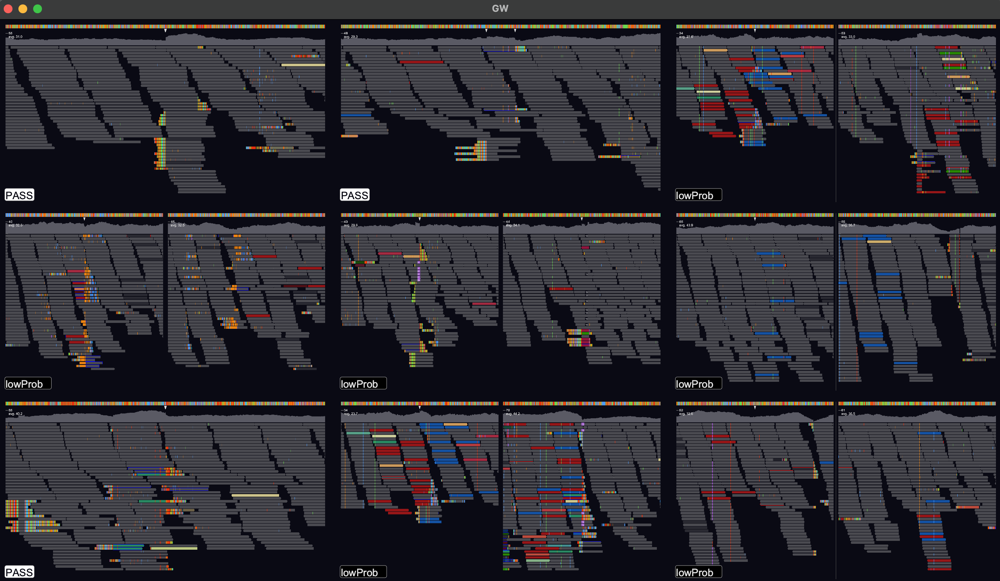

GW
==

|Build badge| |Generic badge| |Li badge| |Dl badge|

.. |Build badge| image:: https://github.com/kcleal/gw/actions/workflows/main.yml/badge.svg
   :target: https://github.com/kcleal/gw/actions/workflows/main.yml

.. |Generic badge| image:: https://img.shields.io/badge/install%20with-bioconda-brightgreen.svg
   :target: http://bioconda.github.io/recipes/gw/README.html

.. |Li badge| image:: https://anaconda.org/bioconda/gw/badges/license.svg
   :target: https://github.com/kcleal/gw/blob/master/LICENSE.md
   
.. |Dl badge| image:: https://img.shields.io/conda/dn/bioconda/gw.svg
   :target: http://bioconda.github.io/recipes/gw/README.html

.. image:: include/resources/images/banner.png
    :align: center

GW is a fast browser for genomic sequencing data (.bam/.cram format) used directly from the terminal. GW also
allows you to view and annotate variants from vcf/bcf files.

Check out the `documentation here. <https://kcleal.github.io/gw/>`_

⚙️ Install
----------

For best performance, download one of the app packages from the Releases page. See the `install section of the documentation <https://kcleal.github.io/gw/docs/install/Install.html>`_ for more details.

Using a package manager:

- brew (Apple or Linux):

``brew install kcleal/homebrew-gw/gw``

- conda (x86_64 Apple or Linux)

``conda install -c bioconda -c conda-forge gw``

Unfortunatly the Linux conda package is not currently working for miniconda/miniforge, altough other distributions may work. To build from source using conda to fetch other dependencies use::

    conda create -y -n gw_env -c conda-forge glfw htslib
    conda activate gw_env
    git clone https://github.com/kcleal/gw.git
    cd gw && make prep
    CONDA_PREFIX=$(conda info --base) LDLIBS+="-lcrypto -lssl" make -j4

🚀 Quick Start
==============
Command line::

    # Start gw (drag and drop bams into window)
    gw hg38

    # View start of chr1
    gw hg38 -b your.bam -r chr1

    # Two regions, side-by-side
    gw hg38 -b your.bam -r chr1:1-20000 -r chr2:50000-60000

    # Multiple bams
    gw hg38 -b '*.bam' -r chr1
    gw hg38 -b b1.bam -b b2.bam -r chr1

    # Add a track BED/VCF/BCF/LABEL
    gw hg38 -b your.bam -r chr1 --track a.bed

    # png image to stdout
    gw hg38 -b your.bam -r chr1:1-20000 -n > out.png

    # Save pdf
    gw hg38 -b your.bam -r chr1:1-20000 -n --fmt pdf -f out.pdf

    # plot every chromosome in parallel
    gw t2t -t 24 -b your.bam -n --outdir chrom_plots

    # View VCF/BCF
    gw hg38 -b your.bam -v var.vcf

    # View VCF/BCF from stdin
    gw hg38 -b your.bam -v -

    # View some png images
    gw -i "images/*.png"

    # Save some annotations
    gw hg38 -b your.bam -v var.vcf --labels Yes,No --out-labels labels.tsv

Here are a few GW commands (others are available). Access command box with ``:`` or ``/``::

    help              # help menu
    config            # open config file for editing
    chr1:1-20000      # Navigate to region
    add chr2:1-50000  # Append new region
    rm 1              # Region at column index 1 removed
    rm bam1           # Bam file at row index 1 removed
    mate              # Move view to mate of read
    mate add          # mate added in new view
    line              # Toggle vertical line
    ylim 100          # View depth increased to 100
    find QNAME        # Highlight all reads with qname==QNAME
    filter mapq >= 10 # Filer reads for mapq >= 10
    count             # Counts of all reads for each view point
    snapshot          # Save screenshot to .png
    man COMMAND       # manual for command

Sequencing data
---------------
To view a genomic region e.g. chr1:1-20000, supply an indexed reference genome and an alignment file (using -b option)::

    gw hg38 -b your.bam -r chr1:1-20000

.. image:: include/resources/images/chr1.png
    :align: center

Variant data
-------------
A variant file in .vcf/.bcf format can be opened in a GW window by either dragging-and-dropping or via the -v option::

    gw hg38.fa -b your.bam -v variants.vcf

Benchmark
=========

See test directory.

Issues and contributing
=======================
If you find bugs, or have feature requests please open an issue, or drop me an email clealk@cardiff.ac.uk.
GW is under active development, and we would welcome any contributions!
