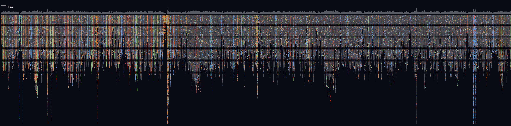
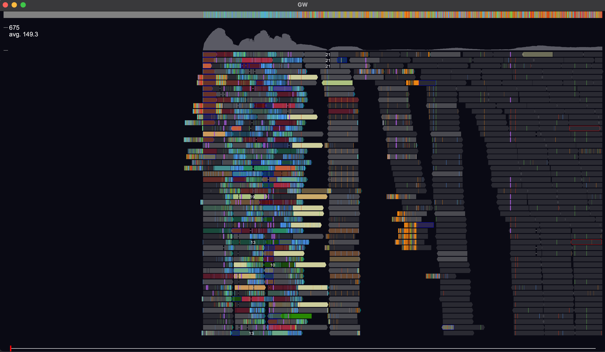

GW
==

|Build badge| |Generic badge| |Li badge| |Dl badge|

.. |Build badge| image:: https://github.com/kcleal/gw/actions/workflows/main.yml/badge.svg
   :target: https://github.com/kcleal/gw/actions/workflows/main.yml

.. |Generic badge| image:: https://img.shields.io/badge/install%20with-bioconda-brightgreen.svg
   :target: http://bioconda.github.io/recipes/gw/README.html

.. |Li badge| image:: https://anaconda.org/bioconda/gw/badges/license.svg
   :target: https://github.com/kcleal/gw/blob/master/LICENSE.md
   
.. |Dl badge| image:: https://img.shields.io/conda/dn/bioconda/gw.svg
   :target: http://bioconda.github.io/recipes/gw/README.html

GW is a fast browser for genomic sequencing data (.bam/.cram format) used directly from the terminal. GW also
allows you to view and annotate variants from vcf/bcf files.

⚙️ Install
----------
Linux x86_64 systems::

    conda install -c conda-forge -c bioconda gw
    
Apple x86_64/arm64::
 
    brew install kcleal/homebrew-gw/gw
    
For windows, install via msys2 or WSL. For msys2, download `msys2 <https://www.msys2.org/>`_, open a ucrt64 terminal (start menu) and install::

    pacman -Sy mingw-w64-ucrt-x86_64-gw

A docker container is available with instructions found `here <https://hub.docker.com/repository/docker/kcleal/gw/>`_::

  docker pull kcleal/gw

Building requires glfw3 and htslib libraries::

    conda install glfw htslib
    export CONDA_PREFIX=/pathTo/miniconda  # this may already be set
    git clone https://github.com/kcleal/gw.git && cd gw
    make prep && make

Build dependencies for ubuntu are also listed in deps folder.

🚀 Quick Start
==============
Command line::

    # Start gw (drag and drop bams into window)
    gw hg38

    # View start of chr1
    gw hg38 -b your.bam -r chr1

    # Two regions, side-by-side
    gw hg38 -b your.bam -r chr1:1-20000 -r chr2:50000-60000

    # Multiple bams
    gw hg38 -b your.bam -b your2.bam -r chr1

    # Add a track BED/VCF/BCF/LABEL
    gw hg38 -b your.bam -r chr1 --track a.bed

    # png image to stdout
    gw hg38 -b your.bam -r chr1:1-20000 -n > out.png

    # Save pdf
    gw hg38 -b your.bam -r chr1:1-20000 -n --fmt pdf -f out.pdf

    # View VCF/BCF
    gw hg38 -b your.bam -v var.vcf

    # View VCF/BCF from stdin
    gw hg38 -b your.bam -v -

    # View some png images
    gw -i "images/*.png"

    # Save some annotations
    gw hg38 -b your.bam -v var.vcf --labels Yes,No --out-labels labels.tsv

GW commands - access command box with ``:`` ::

    :help              # help menu
    :config            # open config file for editing
    :chr1:1-20000      # Navigate to region
    :add chr2:1-50000  # Append new region
    :rm 1              # Region at column index 1 removed
    :rm bam1           # Bam file at row index 1 removed
    :mate              # Move view to mate of read
    :mate add          # mate added in new view
    :line              # Toggle vertical line
    :ylim 100          # View depth increased to 100
    :find QNAME        # Highlight all reads with qname==QNAME
    :filter mapq >= 10 # Filer reads for mapq >= 10
    :count             # Counts of all reads for each view point
    :snapshot          # Save screenshot to .png
    :man COMMAND       # manual for command

📖 User Guide
=============

Sequencing data
---------------
To view a genomic region e.g. chr1:1-20000, supply an indexed reference genome and an alignment file (using -b option)::

    gw hg38 -b your.bam -r chr1:1-20000

The `hg38` argument will load a remote reference genome, replace this with the path to a local file for best performance.
A GW window will open and can be used interactively with the mouse and keyboard. Note multiple -b and -r options can be used.

Various commands are also available via the GW window. Simply click on the GW window and type `:help` which will display a list of commands in your terminal.
For example typeing `:chr1` will navigate to the start of chromosome 1. For more information about each command type `:man [command]`.

.. image:: include/help.png
    :align: center
    :scale: 50%

A GW window can also be started with only the reference genome as a positional argument::

    gw hg38.fa

You can then drag-and-drop alignment files and vcf files into the window, and use commands to navigate to regions etc.

GW can also be used to generate images in .png/.pdf format of target genomic regions.
To use this function apply the ``--no-show`` option along with an output folder ``--outdir``::

    gw hg38.fa -b your.bam -r chr1:1-20000 --outdir . --no-show

    gw hg38.fa -b your.bam -r chr1:1-20000 --outdir . --no-show --fmt pdf

Variant data
-------------
A variant file in .vcf/.bcf format can be opened in a GW window by either dragging-and-dropping or via the -v option::

    gw hg38.fa -b your.bam -v variants.vcf

.. image:: include/tiles.png
    :align: center

This will open a window in tiled mode. To change the number of tiles use the up/down arrow keys to change interactively or use the -n option to control the dimensions::

    gw hg38.fa -n 8x8 -b your.bam -v variants.vcf

If you right-click on one of the tiles then the region will be opened for browsing. To get back to the tiled-image view,
just right-click again.

Vcf/bcf files can be open in a stream e.g. using bcftools + gw to select and view regions::

    bcftools view -r chr1:1-1000000 your.bcf | gw hg38 -b your.bam -v -

You can also generate an image of every variant in your vcf file - as before use the ``--outdir`` and ``--no-show`` options. Also,
you might want to increase the number of threads used here to speed things up a bit. Be warned this will probably generate a huge number of files::

    gw hg38.fa -b your.bam -v variants.vcf --outdir all_images --no-show -t 16

The time taken here depends a great deal on the speed of your hard drive and depth of coverage, but using a fast
NVMe SSD for example, you can expect a throughput around 30-80 images per second.

Labelling variant data
----------------------
GW is designed to make manually labelling 100s - 1000s of variants as pain free as possible. Labels can be saved to
a tab-separated file and opened at a later date to support labelling over multiple sessions.
GW can also write a modified vcf, updating the vcf filter column with curated labels.

To use labelling in GW, first ensure all variant IDs in your input vcf are unique.

When you open a vcf file, GW will parse the 'filter' column and display this as a label in the bottom
left-hand corner of image tiles. Other labels can be parsed from the vcf using the ``--parse-label`` option.
For example, the "SU" tag can be parsed from the info column using::

    gw hg38.fa -b your.bam -v variants.vcf --parse-label info.SU

Image tiles can then be clicked-on to modify the label, choosing between PASS/FAIL by default.
To provide a list of alternate labels, use the ``--labels`` option::

    gw hg38.fa -b your.bam -v variants.vcf --labels Yes,No,Maybe

Now when you left-click on a tiled image, you can cycle through this list.

To save or open a list of annotations, we recommend using the ``--in-labels`` and ``--out-labels`` options. This makes it
straightforward to keep track of labelling progress between sessions. Only variants that have been displayed to screen will be appended to
the results in ``--out-labels``::

    gw hg38 -b your.bam -v variants.vcf --in-labels labels.tsv --out-labels labels.tsv

Labels are output as a tab-separated file, for example:

.. list-table::
   :widths: 25 25 25 25 25 25
   :header-rows: 1

   * - #chrom
     - pos
     - variant_ID
     - label
     - var_type
     - labelled_date
   * - chr1
     - 200000
     - 27390
     - PASS
     - DEL
     -
   * - chr1
     - 250000
     - 2720
     - FAIL
     - SNP
     - 14-10-2022 16-05-46

The labelled_date column is only filled out if one of the tiled images was manually clicked - if this field is blank then
the ``--parsed-label`` was used. This feature allows you to keep track of which variants were user-labelled over multiple sessions.
Additionally, the ``--out-labels`` file is auto-saved every minute for safe keeping.

GW can also write labels to a vcf file. We recommend using this feature to finalise your annotation - the whole vcf file
will be written to ``--out-vcf``. The final label will appear in the 'filter' column in the vcf. Additionally, the date and previous filter label
are kept in the info column under ``GW_DATE``, ``GW_PREV``::

    gw hg38.fa -b your.bam -v variants.vcf --in-labels labels.tsv --out-vcf final_annotations.vcf

Note, the ``--in-labels`` option is not required here, but could be used if labelling over multiple sessions, for example. Also,
a GW window will still pop-up here, but this could be supressed using the ``--no-show option``.

Viewing png images
-------------------
Images saved in .png format can be opened in a similar way to variant data, using the ``-i`` or ``--images`` option. Files are
input using a glob pattern. For example all .png images in a folder called 'images' can be opened with::

    gw -i "images/*.png"

If you previously used GW to generate images from a vcf file (see example in Variant data section), any parsed-labels will be saved in the ``--outdir`` directory.
For example if ``--outdir images`` was used when generating images, you can now view these images and labels using::

  gw -i "images/*.png" --in-labels images/gw.parsed_labels.tsv

To open one or more bam files alongside your images you will need to supply a reference genome. Right-clicking using the mouse will then switch between images and bam files::

  gw hg38.fa -b your.bam -i "images/*.png"

Filtering and counting
----------------------
To focus on reads of interest, GW can filter reads using simple filter expressions provided via the ``:filter`` command (or ``--filter`` option). The syntax for a filter expression follows ``"{property} {operation} {value}"`` (the white-spaces are also needed). For example, here are some useful expressions::

    :filter mapq >= 20             # only reads with mapping quality >= 20 will be shown
    :filter flag & 2048            # only supplementary alignments are shown
    :filter flag & supplementary   # same as above
    :filter ~flag & supplementary  # supplementary reads will be removed
    :filter seq contains TTAGGG    # Only reads with TTAGGG kmer will be shown
    :filter seq omit AAAAAA        # Reads with this kmer will be removed
    :filter mapq > 30 and ~flag & duplicate  #  also removes duplicate reads
    :filter mapq > 10 or seq-len > 100; ~flag & duplicate  # > 1 statements

These expressions will apply filtering to all image panes (regions and bams). If you want to be more selective, you can
use array indexing notation to filter on certain rows (bam files) or columns (regions). For example::

    :filter mapq > 0 [:, 0]   # All rows, column 0 (all bams, first region only)
    :filter mapq > 0 [0, :]   # Row 0, all columns (the first bam only, all regions)
    :filter mapq > 0 [1, -1]  # Row 1, last column

To remove all filters use the ``:refresh`` command.

Here is the list of properties you can use (see the `sam specification <https://en.wikipedia.org/wiki/SAM_(file_format)>`_ for more details on the meaning of tags)::

    maps, flag, ~flag, name, tlen, abs-tlen, rnext, pos, ref-end, pnext, seq, seq-len,
    RG, BC, BX, RX, LB, MD, MI, PU, SA, MC, NM, CM, FI, HO, MQ, SM, TC, UQ, AS

These can be combined with operators::

    &, ==, !=, >, <, >=, <=, eq, ne, gt, lt, ge, le, contains, omit

Flag properties can be accessed using keywords, for more info see `here <https://broadinstitute.github.io/picard/explain-flags.html>`_::

    paired, proper-pair, unmapped, munmap, reverse, mreverse, read1, read2, secondary, dup, supplementary

Once reads have been filtered, you can try the ``:count`` command which will give you an output similar to ``samtools flagstats``. The ``:count`` command can also be used with an expression e.g.::

    :count mapq > 0

Remote
------

GW can be used on remote servers by using ``ssh -X`` when logging on to the server, a GW window will show up on your local screen. However performance will generally be slow and laggy. We recommend adding an update delay (in miliseconds) using ``gw --delay 100 ...`` which can help prevent bandwidth/latency issues.

Alternatively, the screen sharing tool `Xpra <https://xpra.org/>`_ can offer much better performance for rendering over a remote connecion.

Xpra will need to be installed on local and remote machines. One way to use Xpra is to start GW on port 100 (on remote machine) using::

    xpra start :100 --start="gw ref.fa -b your.bam -r chr1:50000-60000" --sharing=yes --daemon=no

You (or potentially multiple users) can view the GW window on your local machine using::

    xpra attach ssh:ubuntu@18.234.114.252:100

The ``:100`` indicates the port. If you need to supply more options to the ssh command use e.g. ``xpra attach ssh:ubuntu@18.234.114.252:102 --ssh "ssh -o IdentitiesOnly=yes -i .ssh/dysgu.pem"``

Config file
-----------

GW ships with a .gw.ini config file. You can manually set various options within the file so you dont have to keep
typing them in every time. The GW command `:config` will open your config file in a text editor for easy access.

Some useful options to set in your .gw.ini file are a list of reference genomes so these can be selected without using a full path.
Also things like the theme, image dimensions and hot-keys can be set.

The .gw.ini file can be copied to your home directory or .config directory for safe-keeping - gw will look in these locations before checking the
local install directory.

Benchmark
=========

Here we're testing the resource usage of GW when generating a single .png image using::

    gw $HG19 -b HG002.bam -r {region} --no-show

The bam file was 40X coverage, paired-end data mapped with bwa mem. All other tools were run with default settings (see the `benchmark.py` script in the test folder for details).
The machine used was an Intel i9-11900K, NVMe WD 2TB, 64 GB memory.

.. list-table::

    * - .. figure:: test/results/time.png

           Mean time (s)

      - .. figure:: test/results/memory.png

           Mean memory (Gb)

Plotting a 2Mb region in GW took ~0.55s compared to IGV ~37s, although its worth noting IGV needed around 6s for start up. For reference,
using :code:`samtools view -c -@3` took ~0.209s which is a measure of how fast a bam file can be read.
Mean memory use for a 2Mb region was 0.54 Gb for GW vs IGV 3.35 Mb. Using --low-mem mode (gw-lm in plot), memory usage
was reduced to 344 Mb.

Issues and contributing
=======================
If you find bugs, or have feature requests please open an issue, or drop me an email clealk@cardiff.ac.uk.
GW is under active development, and we would welcome any contributions!
